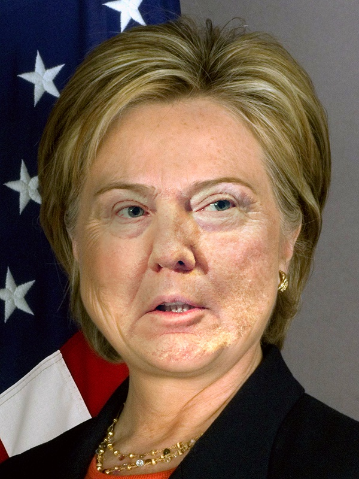
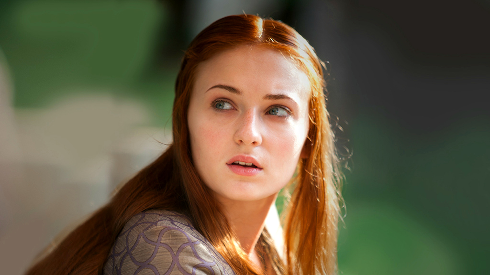
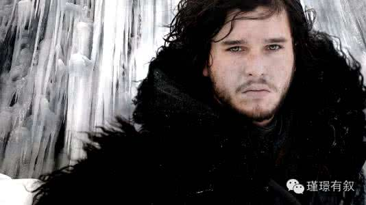
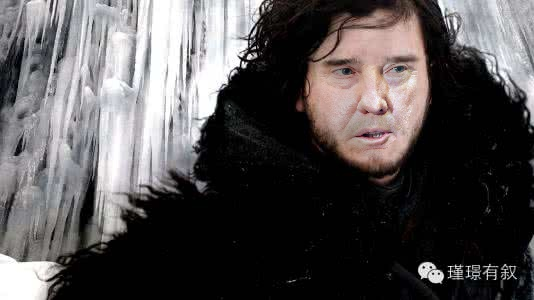
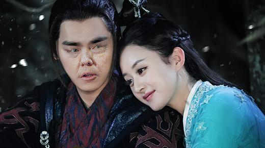
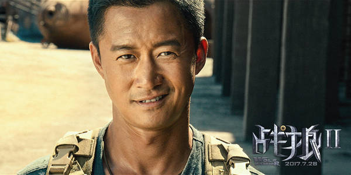
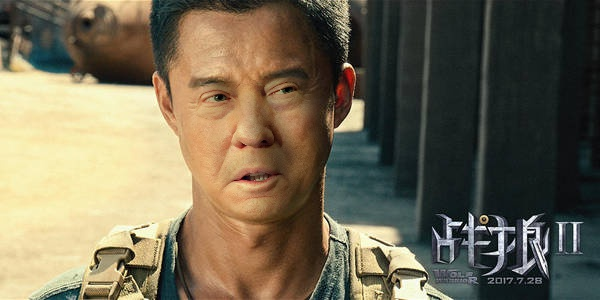

# FaceSwap
Swap face between two photos for Python 3 with OpenCV and dlib.

## Get Started
```sh
python main.py --src imgs/test6.jpg --dst imgs/test7.jpg --out results/output6_7.jpg --correct_color
```

| Source | Destination | Result |
| --- | --- | --- |
| |  |  |

```sh
python main.py --src imgs/test6.jpg --dst imgs/test7.jpg --out results/output6_7_2d.jpg --correct_color --warp_2d
```

| Source | Destination | Result |
| --- | --- | --- |
| |  |  |


## Install
### Requirements
* `pip install -r requirements.txt`
* OpenCV 3: `conda install opencv` (If you have conda/anaconda)

Note: See [requirements.txt](requirements.txt) for more details.
### Git Clone
```sh
git clone https://github.com/wuhuikai/FaceSwap.git
```
### Swap Your Face
```sh
python main.py ...
```
Note: Run **python main.py -h** for more details.


### Real-time camera
```sh
python main_video.py --src_img imgs/test7.jpg --show --correct_color --save_path {*.avi}
```
### Video
```sh
python main_video.py --src_img imgs/test7.jpg --video_path {video_path} --show --correct_color --save_path {*.avi}
```

## More Results
| From | To |
| --- | --- |
|  |  |
|  |  |
|  |  |
|  |  |
|  |  |
