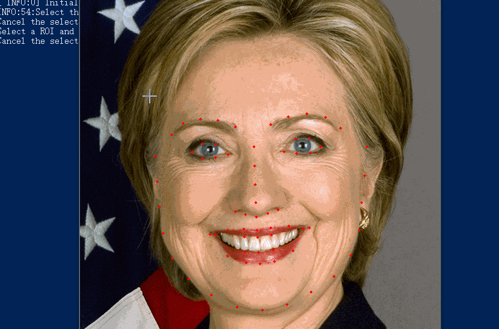

# FaceSwap
Swap face between two photos for Python 3 with OpenCV and dlib.

## Get Started
```sh
python main.py --src imgs/test6.jpg --dst imgs/test7.jpg --out results/output6_7.jpg --correct_color
```

| Source | Destination | Result |
| --- | --- | --- |
| |  |  |

```sh
python main.py --src imgs/test6.jpg --dst imgs/test7.jpg --out results/output6_7_2d.jpg --correct_color --warp_2d
```

| Source | Destination | Result |
| --- | --- | --- |
| |  |  |


## Install
### Requirements
* [dlib](http://dlib.net/)
* OpenCV 3

Note: See [requirements.txt](requirements.txt) for more details.
### Git Clone
```sh
git clone https://github.com/wuhuikai/FaceSwap.git
```
### Swap Your Face
```sh
python main.py ...
```
Note: Run **python main.py -h** for more details.


### Real-time camera
For some reason, you need to put haarcascade_frontalface_default.xml([Location of haarcascade_frontalface_default.xml](https://stackoverflow.com/questions/47639057/location-of-opencv-haarcascade-frontalface-default-xml)) in folder `models/` manually. 
```sh
python video_handler --src_img imgs/test7.jpg
```
### Video
```sh
python video_handler --src_img imgs/test7.jpg --video_path video/test.mov
```
Make sure the landmarks actually locate in the face.Then drag the left mouse to make a rectangle, it should surround the face.Finally, we handle our video.Note that the demo works best with good, even lighting. The demo also needs support for opencv TRACKER(see config). 


## More Results
| From | To |
| --- | --- |
|  |  |
|  |  |
|  |  |
|  |  |
|  |  |
